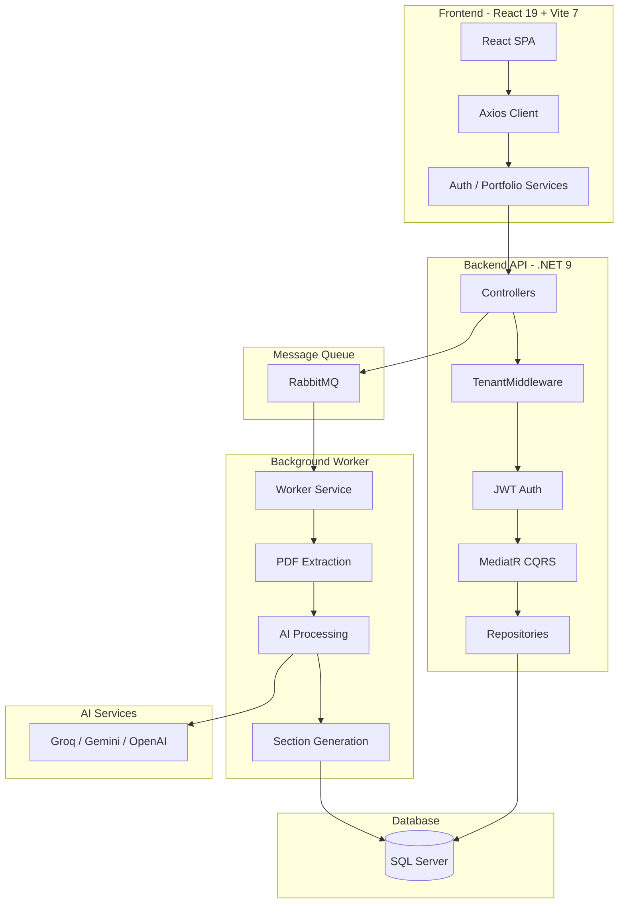
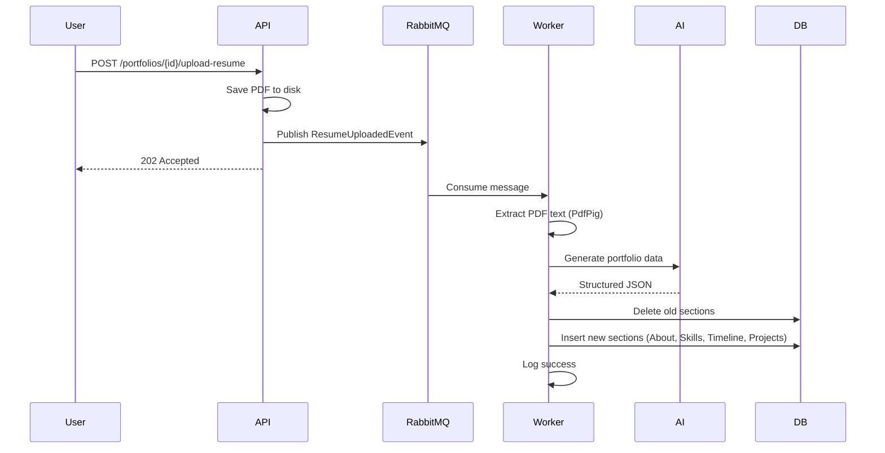
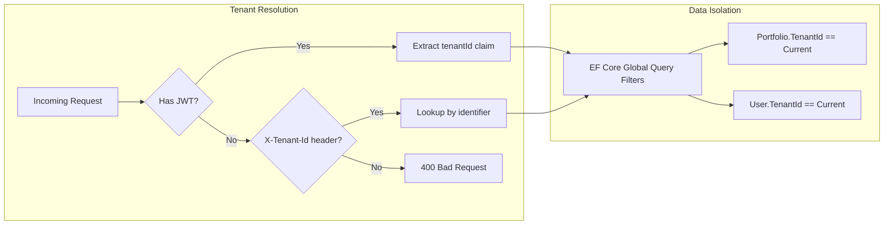

# FolioForge.ai 🚀

> **The Intelligent, Multi-Tenant, Event-Driven Portfolio Platform**
>
> Transform static PDF resumes into dynamic, deployable personal websites in seconds using AI-powered parsing, multi-tenant isolation, and a flexible widget system.

[](https://dotnet.microsoft.com/)
[](https://react.dev/)
[](https://www.rabbitmq.com/)
[](LICENSE)

---

## 📖 Overview

**FolioForge.ai** is a multi-tenant SaaS platform designed to host personalized portfolios at scale. It leverages **Event-Driven Architecture** and **Clean Architecture** principles to provide a robust, maintainable, and extensible solution for Resume-to-Web conversion.

### The Problem We Solve

- **Static site generators** require manual configuration and technical expertise
- **Traditional resume builders** are rigid and template-locked
- **Portfolio hosting** lacks flexibility, multi-tenancy, and modern design systems

**FolioForge.ai** uses a **Generic Widget System** (inspired by Notion blocks) that decouples data from presentation, enabling infinite customization without database migrations. Each tenant operates in complete data isolation, and JWT-based authentication ensures secure access.

---

## 🏗️ Architecture & Design Philosophy

Built on **Clean Architecture** principles with a **CQRS-inspired** flow using MediatR to separate write (commands) from read (queries) operations.

### System Architecture



### Event-Driven Resume Processing Flow



### Multi-Tenant Architecture



---

## 🛠️ Tech Stack

### Backend

| Component | Technology | Version | Purpose |
|-----------|-----------|---------|---------|
| **Framework** | .NET | 9.0 | Modern web API with Controllers |
| **Architecture** | Clean Architecture + CQRS | — | Separation of concerns, testability |
| **Database** | SQL Server | — | Relational data with JSON column support |
| **ORM** | Entity Framework Core | 9.0 | Type-safe database access with global query filters |
| **Authentication** | JWT Bearer | — | Stateless token-based auth with BCrypt password hashing |
| **Messaging** | RabbitMQ | 3.x | Async job processing via event-driven architecture |
| **PDF Parsing** | PdfPig | — | Extract text from resume PDFs |
| **AI/LLM** | Groq (Llama 3.3), Gemini 2.0, OpenAI | — | Resume parsing & content generation |
| **CQRS** | MediatR | 14.x | Command/Query separation |

### Frontend

| Component | Technology | Version | Purpose |
|-----------|-----------|---------|---------|
| **Framework** | React | 19.2 | Modern SPA with hooks |
| **Build Tool** | Vite | 7.3 | Fast HMR, optimized builds |
| **Styling** | Tailwind CSS | 3.4 | Utility-first CSS framework |
| **Animations** | Framer Motion | 12.x | Scroll-triggered transitions, particle effects |
| **HTTP Client** | Axios | 1.13 | Interceptor-based API communication with JWT injection |
| **Routing** | React Router | 7.13 | Client-side routing with protected routes |
| **Particles** | tsParticles | 3.x | Interactive particle hero background |
| **Theming** | Context API | — | Dark/Light mode support with system preference detection |

### DevOps & CI/CD

| Component | Technology | Purpose |
|-----------|-----------|---------|
| **CI** | GitHub Actions | Automated build, lint, test on push/PR |
| **PR Checks** | GitHub Actions + dorny/paths-filter | Smart path-based checks (only run what changed) |
| **Deployment** | GitHub Actions | Artifact build pipeline (API, Worker, Frontend) |
| **Linting** | ESLint 9 | React hooks, refresh, and JSX variable rules |

---

## 📂 Project Structure

```
FolioForge.ai/
├── .github/
│   └── workflows/
│       ├── ci.yml                        # 🔄 CI — build + lint + test
│       ├── deploy.yml                    # 🚀 Deploy — artifact build pipeline
│       └── pr-checks.yml                # ✅ PR — smart path-filtered checks
│
├── backend/
│   ├── FolioForge.sln                    # Solution file (5 projects)
│   └── src/
│       ├── FolioForge.Api/               # 🌐 API Layer (Controllers, Auth, Middleware)
│       ├── FolioForge.Application/       # 📋 Application Layer (CQRS, DTOs, Interfaces)
│       ├── FolioForge.Domain/            # 💎 Domain Layer (Entities, Tenant model)
│       ├── FolioForge.Infrastructure/    # 🔧 Infrastructure (EF Core, AI, RabbitMQ, JWT)
│       └── FolioForge.Worker/            # ⚙️ Background Worker (Resume processing)
│
└── folioforge.client/                    # ⚛️ React Frontend
    └── src/
        ├── api/                          # Axios client with JWT/tenant interceptors
        ├── components/                   # Reusable UI (animations, layout, theme)
        ├── config/                       # Environment configuration
        ├── context/                      # AuthContext, ThemeContext providers
        ├── features/                     # Portfolio sections (Hero, Skills, Timeline, etc.)
        ├── hooks/                        # Custom React hooks (usePortfolio)
        ├── pages/                        # Login, Register, Dashboard, Portfolio
        └── services/                     # Auth & Portfolio API services
```

> 📚 **Each layer has its own README** with detailed documentation. See the respective folders.

---

## ⚡ Features

### ✅ Implemented

| Feature | Description |
|---------|-------------|
| **Multi-Tenancy** | Shared-database, row-level tenant isolation via EF Core global query filters |
| **JWT Authentication** | Register, Login, /me endpoints with BCrypt hashing and 24h token expiry |
| **Tenant Middleware** | Automatic tenant resolution from JWT claims or X-Tenant-Id header |
| **Clean Architecture** | 4-layer separation (API, Application, Domain, Infrastructure) |
| **CQRS with MediatR** | Command/Query separation for portfolio operations |
| **Event-Driven Processing** | RabbitMQ-based async resume processing |
| **AI-Powered Parsing** | Groq (Llama 3.3), Gemini 2.0 Flash, OpenAI integration |
| **PDF Text Extraction** | PdfPig-based resume text extraction |
| **Generic Widget System** | Flexible JSON-based section storage (About, Skills, Timeline, Projects) |
| **Smart Bullet Points** | AI extracts achievements as structured arrays, not paragraphs |
| **Protected Routes** | Frontend route guards with auth bootstrapping from localStorage |
| **React Portfolio Viewer** | Animated, responsive portfolio display with scroll-triggered reveals |
| **Dark/Light Theme** | System-aware theme switching with localStorage persistence |
| **Particle Hero** | Interactive tsParticles background with gradient text |
| **Animated Sections** | Framer Motion scroll animations (fade-in, slide, stagger) |
| **CI/CD Pipelines** | GitHub Actions for CI, PR checks (path-filtered), and deployment |

### 🔜 Planned

- [ ] Drag-and-drop section editor
- [ ] Custom domain support
- [ ] PDF resume download from portfolio
- [ ] Analytics dashboard
- [ ] Role-based access control (RBAC)
- [ ] Subdomain-based tenant routing

---

## 🔐 Authentication & Multi-Tenancy

### Authentication Flow

```
Register → POST /api/auth/register { email, fullName, password, tenantIdentifier }
                ↓
         Validate tenant exists & is active
         Check email globally unique
         BCrypt hash password
         Create User with TenantId
         Generate JWT (sub, email, fullName, tenantId)
                ↓
         ← { token, userId, email, fullName, tenantId, tenantIdentifier }

Login → POST /api/auth/login { email, password }
                ↓
         Lookup user across all tenants (bypasses query filters)
         Verify BCrypt hash
         Resolve tenant from user's TenantId
         Generate JWT
                ↓
         ← { token, userId, email, fullName, tenantId, tenantIdentifier }
```

### Tenant Data Isolation

- **Strategy:** Shared database with `TenantId` column on `Portfolio` and `User` entities
- **Enforcement:** EF Core global query filters automatically scope all queries
- **Resolution:** JWT `tenantId` claim (primary) → `X-Tenant-Id` header (fallback)
- **Excluded routes:** `/api/auth/*`, `/api/tenants/*`, `/swagger/*`, `/health`

### JWT Token Claims

| Claim | Description |
|-------|-------------|
| `sub` | User ID (GUID) |
| `email` | User email address |
| `fullName` | User display name |
| `tenantId` | Tenant ID for data isolation |
| `jti` | Unique token identifier |
| `exp` | Expiration (24 hours) |

---

## 🚀 Getting Started

### Prerequisites

- [.NET 9 SDK](https://dotnet.microsoft.com/download)
- [Node.js 22+](https://nodejs.org/)
- [SQL Server](https://www.microsoft.com/sql-server) (or LocalDB / Docker)
- [RabbitMQ](https://www.rabbitmq.com/) (or Docker)

### Quick Start

#### 1. Clone the Repository

```bash
git clone https://github.com/yourusername/FolioForge.ai.git
cd FolioForge.ai
```

#### 2. Start Infrastructure (Docker)

```bash
# Start SQL Server
docker run --name folioforge-sql \
  -e "ACCEPT_EULA=Y" \
  -e "MSSQL_SA_PASSWORD=YourStrong@Password123" \
  -p 1433:1433 \
  -d mcr.microsoft.com/mssql/server:2022-latest

# Start RabbitMQ
docker run --name folioforge-rabbit \
  -p 5672:5672 \
  -p 15672:15672 \
  -d rabbitmq:3-management
```

#### 3. Configure Backend

Update `backend/src/FolioForge.Api/appsettings.json`:

```json
{
  "ConnectionStrings": {
    "DefaultConnection": "Server=localhost;Database=folioforge;Integrated Security=True;TrustServerCertificate=True"
  },
  "Jwt": {
    "Secret": "YourSuperSecretKeyAtLeast32CharsLong!!",
    "Issuer": "FolioForge",
    "Audience": "FolioForge.Client",
    "ExpirationMinutes": "1440"
  },
  "Groq": {
    "ApiKey": "your-groq-api-key"
  }
}
```

#### 4. Run Database Migrations

```bash
cd backend/src/FolioForge.Api
dotnet ef database update --project ../FolioForge.Infrastructure/FolioForge.Infrastructure.csproj
```

#### 5. Start Backend Services

```bash
# Terminal 1: Start API (http://localhost:5090)
cd backend/src/FolioForge.Api
dotnet run

# Terminal 2: Start Worker (resume processing)
cd backend/src/FolioForge.Worker
dotnet run
```

#### 6. Start Frontend

```bash
cd folioforge.client
npm install
npm run dev
```

#### 7. Access the Application

| Service | URL |
|---------|-----|
| **Frontend** | http://localhost:5173 |
| **API Swagger** | http://localhost:5090/swagger |
| **RabbitMQ Dashboard** | http://localhost:15672 (guest/guest) |

#### 8. Create a Tenant & User

```bash
# Create a tenant
curl -X POST http://localhost:5090/api/tenants \
  -H "Content-Type: application/json" \
  -d '{"name": "My Workspace", "identifier": "my-workspace"}'

# Register a user
curl -X POST http://localhost:5090/api/auth/register \
  -H "Content-Type: application/json" \
  -d '{"email": "you@email.com", "fullName": "Your Name", "password": "SecurePass123", "tenantIdentifier": "my-workspace"}'
```

---

## 🔄 API Endpoints

### Authentication

| Method | Endpoint | Auth | Description |
|--------|----------|------|-------------|
| `POST` | `/api/auth/register` | — | Register user under a tenant |
| `POST` | `/api/auth/login` | — | Login with email/password |
| `GET` | `/api/auth/me` | JWT | Get current user profile |

### Tenant Management

| Method | Endpoint | Auth | Description |
|--------|----------|------|-------------|
| `POST` | `/api/tenants` | — | Create a new tenant/workspace |
| `GET` | `/api/tenants/{id}` | — | Get tenant details by ID |

### Portfolio Management

| Method | Endpoint | Auth | Description |
|--------|----------|------|-------------|
| `POST` | `/api/portfolios` | JWT | Create new portfolio |
| `GET` | `/api/portfolios/{id}` | JWT | Get portfolio by ID (with sections) |
| `GET` | `/api/portfolios/{slug}` | JWT | Get portfolio by slug |
| `POST` | `/api/portfolios/{id}/upload-resume` | JWT | Upload PDF resume for AI processing |

### Request/Response Examples

**Register:**
```bash
curl -X POST http://localhost:5090/api/auth/register \
  -H "Content-Type: application/json" \
  -d '{"email": "john@example.com", "fullName": "John Doe", "password": "Password123!", "tenantIdentifier": "my-workspace"}'

# Response:
# { "token": "eyJ...", "userId": "...", "email": "john@example.com",
#   "fullName": "John Doe", "tenantId": "...", "tenantIdentifier": "my-workspace" }
```

**Upload Resume:**
```bash
curl -X POST http://localhost:5090/api/portfolios/{id}/upload-resume \
  -H "Authorization: Bearer <token>" \
  -F "file=@resume.pdf"

# Response: 202 Accepted (processing happens async via RabbitMQ)
```

---

## 🧪 Architecture Deep Dive

### Layer Dependencies

```
┌─────────────────────────────────────────────────────┐
│                    API Layer                         │
│   (Controllers, Auth, Middleware, Swagger, DI)       │
└─────────────────────┬───────────────────────────────┘
                      │ depends on
                      ▼
┌─────────────────────────────────────────────────────┐
│               Application Layer                      │
│  (Commands, Queries, Handlers, DTOs, Interfaces)     │
└─────────────────────┬───────────────────────────────┘
                      │ depends on
                      ▼
┌─────────────────────────────────────────────────────┐
│                  Domain Layer                        │
│   (Entities, Value Objects, Tenant Interfaces)       │
└─────────────────────────────────────────────────────┘
                      ▲
                      │ implements interfaces from
┌─────────────────────┴───────────────────────────────┐
│              Infrastructure Layer                    │
│  (EF Core, JWT, Repositories, AI, RabbitMQ, PDF)     │
└─────────────────────────────────────────────────────┘
```

### Key Design Patterns

| Pattern | Usage |
|---------|-------|
| **Repository Pattern** | Abstract data access behind interfaces |
| **CQRS** | Separate read (queries) from write (commands) via MediatR |
| **Mediator Pattern** | Decouple request handling with `IRequest`/`IRequestHandler` |
| **Factory Pattern** | Create PortfolioSection with `Create()` static method |
| **Result Pattern** | Type-safe success/failure handling without exceptions |
| **Event-Driven** | Async resume processing via RabbitMQ publish/subscribe |
| **Global Query Filters** | Automatic tenant scoping at the ORM level |
| **Marker Interface** | `ITenantEntity` for polymorphic tenant assignment in `SaveChangesAsync` |

---

## 📊 Database Schema

```sql
-- Tenants Table
CREATE TABLE tenants (
    Id UNIQUEIDENTIFIER PRIMARY KEY,
    Name NVARCHAR(100) NOT NULL,
    Identifier NVARCHAR(50) NOT NULL UNIQUE,  -- URL-friendly slug
    IsActive BIT NOT NULL DEFAULT 1,
    CreatedAt DATETIME2 NOT NULL,
    UpdatedAt DATETIME2 NOT NULL
);

-- Users Table
CREATE TABLE users (
    Id UNIQUEIDENTIFIER PRIMARY KEY,
    Email NVARCHAR(256) NOT NULL UNIQUE,       -- Globally unique
    FullName NVARCHAR(100) NOT NULL,
    PasswordHash NVARCHAR(MAX) NOT NULL,       -- BCrypt hash
    TenantId UNIQUEIDENTIFIER NOT NULL,        -- FK to tenants
    CreatedAt DATETIME2 NOT NULL,
    UpdatedAt DATETIME2 NOT NULL
);

-- Portfolios Table
CREATE TABLE portfolios (
    Id UNIQUEIDENTIFIER PRIMARY KEY,
    UserId UNIQUEIDENTIFIER NOT NULL,
    TenantId UNIQUEIDENTIFIER NOT NULL,        -- Row-level isolation
    Slug NVARCHAR(50) NOT NULL,                -- Unique per tenant
    Title NVARCHAR(100) NOT NULL,
    IsPublished BIT NOT NULL DEFAULT 1,
    Theme NVARCHAR(MAX) NOT NULL,              -- JSON: { Name, PrimaryColor, FontBody }
    CreatedAt DATETIME2 NOT NULL,
    UpdatedAt DATETIME2 NOT NULL,
    UNIQUE(TenantId, Slug)                     -- Composite unique
);

-- Portfolio Sections Table (Generic Widget Storage)
CREATE TABLE portfolio_sections (
    Id UNIQUEIDENTIFIER PRIMARY KEY,
    PortfolioId UNIQUEIDENTIFIER NOT NULL REFERENCES portfolios(Id) ON DELETE CASCADE,
    SectionType NVARCHAR(50) NOT NULL,         -- 'About', 'Skills', 'Timeline', 'Projects'
    SortOrder INT NOT NULL DEFAULT 0,
    IsVisible BIT NOT NULL DEFAULT 1,
    Content NVARCHAR(MAX) NOT NULL,            -- JSON content blob
    CreatedAt DATETIME2 NOT NULL,
    UpdatedAt DATETIME2 NOT NULL
);
```

### JSON Content Examples

**About Section:**
```json
{ "content": "Experienced full-stack engineer with 5+ years building scalable web applications." }
```

**Skills Section:**
```json
{ "items": ["C#", ".NET", "React", "TypeScript", "Azure", "Docker", "SQL Server"] }
```

**Experience Section (Structured Bullet Points):**
```json
{
  "items": [
    {
      "Company": "Tech Corp",
      "Role": "Senior Engineer",
      "Points": [
        "Led microservices migration reducing latency by 40%",
        "Mentored team of 5 junior developers",
        "Implemented CI/CD pipeline with Azure DevOps"
      ]
    }
  ]
}
```

**Projects Section (Structured Bullet Points):**
```json
{
  "items": [
    {
      "Name": "FolioForge.ai",
      "TechStack": "React, .NET 9, RabbitMQ",
      "Points": [
        "Built AI-powered resume parsing with 95% accuracy",
        "Implemented event-driven architecture for scalability",
        "Designed responsive portfolio viewer with animations"
      ]
    }
  ]
}
```

---

## 🤝 Contributing

1. **Fork** the repository
2. **Create** a feature branch (`git checkout -b feature/amazing-feature`)
3. **Commit** your changes (`git commit -m 'feat: add amazing feature'`)
4. **Push** to the branch (`git push origin feature/amazing-feature`)
5. **Open** a Pull Request

### Commit Convention

We follow [Conventional Commits](https://www.conventionalcommits.org/):

| Prefix | Usage |
|--------|-------|
| `feat:` | New feature |
| `fix:` | Bug fix |
| `docs:` | Documentation changes |
| `refactor:` | Code refactoring |
| `test:` | Adding tests |
| `chore:` | Maintenance tasks |
| `ci:` | CI/CD changes |

---

## 📄 License

This project is licensed under the **MIT License** - see the [LICENSE](LICENSE) file for details.

---

## 👨‍💻 Author

**Shivansh**
📧 [Contact](mailto:your.email@example.com) • 💼 [LinkedIn](#) • 🌐 [Portfolio](#)

---

<div align="center">

**⭐ If you find this project interesting, please give it a star! ⭐**

Made with 💙 and ☕ by developers, for developers

[Report Bug](https://github.com/yourusername/FolioForge.ai/issues) • [Request Feature](https://github.com/yourusername/FolioForge.ai/issues)

</div>
