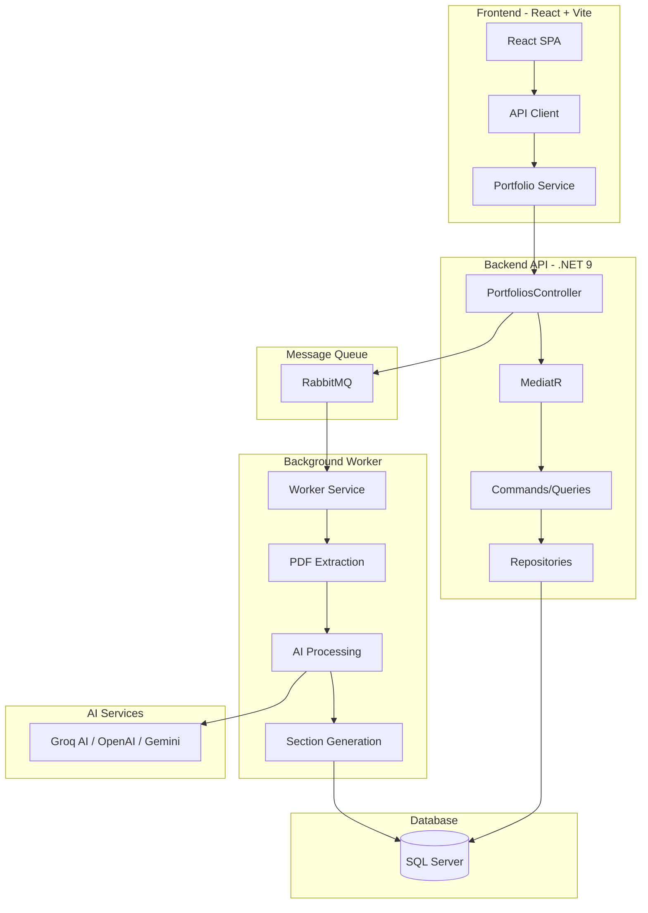

# FolioForge.ai 🚀

> **The Intelligent, Event-Driven Portfolio Platform**
> 
> Transform static PDF resumes into dynamic, deployable personal websites in seconds using AI-powered parsing and a flexible widget system.

[](https://dotnet.microsoft.com/)
[](https://react.dev/)
[](LICENSE)

---

## 📖 Overview

**FolioForge.ai** is a multi-tenant SaaS platform designed to host personalized portfolios at scale. It leverages **Event-Driven Architecture** and **Clean Architecture** principles to provide a robust, maintainable, and extensible solution for Resume-to-Web conversion.

### The Problem We Solve

- **Static site generators** require manual configuration and technical expertise
- **Traditional resume builders** are rigid and template-locked
- **Portfolio hosting** lacks flexibility and modern design systems

**FolioForge.ai** uses a **Generic Widget System** (inspired by Notion blocks) that decouples data from presentation, enabling infinite customization without database migrations.

---

## 🏗️ Architecture & Design Philosophy

Built on **Clean Architecture** principles with a **CQRS-inspired** flow using MediatR to separate write (commands) from read (queries) operations.

### System Architecture



### Event-Driven Resume Processing Flow


---

## 🛠️ Tech Stack

### Backend

| Component | Technology | Purpose |
|-----------|-----------|---------|
| **Framework** | .NET 9 | Modern web API with Controllers |
| **Architecture** | Clean Architecture + CQRS | Separation of concerns, testability |
| **Database** | SQL Server | Relational data with JSON column support |
| **ORM** | Entity Framework Core 9 | Type-safe database access |
| **Messaging** | RabbitMQ | Async job processing |
| **PDF Parsing** | PdfPig | Extract text from resume PDFs |
| **AI/LLM** | Groq (Llama 3.3), OpenAI, Gemini | Resume parsing & content generation |
| **CQRS** | MediatR | Command/Query separation |

### Frontend

| Component | Technology | Purpose |
|-----------|-----------|---------|
| **Framework** | React 19 + Vite | Modern SPA with HMR |
| **Styling** | Tailwind CSS 4 | Utility-first CSS framework |
| **Animations** | Framer Motion | Stunning transitions & animations |
| **HTTP Client** | Axios | API communication |
| **State** | React Hooks | Local component state |
| **Theming** | Context API | Dark/Light mode support |

### Infrastructure

| Component | Technology | Purpose |
|-----------|-----------|---------|
| **Message Broker** | RabbitMQ | Event-driven processing |
| **Background Jobs** | .NET Worker Service | Long-running message consumer |
| **API Docs** | Swagger/OpenAPI | Interactive API documentation |

---

## 📂 Project Structure

```
FolioForge.ai/
├── backend/
│   ├── FolioForge.sln                    # Solution file
│   └── src/
│       ├── FolioForge.Api/               # 🌐 API Layer (Controllers, DI)
│       ├── FolioForge.Application/       # 📋 Application Layer (CQRS, DTOs)
│       ├── FolioForge.Domain/            # 💎 Domain Layer (Entities, Interfaces)
│       ├── FolioForge.Infrastructure/    # 🔧 Infrastructure (EF Core, Services)
│       └── FolioForge.Worker/            # ⚙️ Background Worker (RabbitMQ Consumer)
│
└── folioforge.client/                    # ⚛️ React Frontend
    └── src/
        ├── api/                          # API client & error handling
        ├── components/                   # Reusable UI components
        ├── features/                     # Feature-specific components
        ├── hooks/                        # Custom React hooks
        ├── pages/                        # Page components
        └── services/                     # API service layer
```

> 📚 **Each layer has its own README** with detailed documentation. See the respective folders.

---

## ⚡ Features

### ✅ Implemented

| Feature | Description |
|---------|-------------|
| **Clean Architecture** | 4-layer separation (API, Application, Domain, Infrastructure) |
| **CQRS with MediatR** | Command/Query separation for portfolio operations |
| **Event-Driven Processing** | RabbitMQ-based async resume processing |
| **AI-Powered Parsing** | Groq (Llama 3.3), OpenAI, Gemini integration |
| **PDF Text Extraction** | PdfPig-based resume text extraction |
| **Generic Widget System** | Flexible JSON-based section storage |
| **Smart Bullet Points** | AI extracts achievements as structured arrays |
| **React Portfolio Viewer** | Animated, responsive portfolio display |
| **Dark/Light Theme** | System-aware theme switching |
| **Particle Hero Animation** | Interactive particle background |
| **Animated Sections** | Framer Motion-powered scroll animations |

### 🔜 Planned

- [ ] User authentication (JWT)
- [ ] Multi-tenancy with subdomain routing
- [ ] Drag-and-drop section editor
- [ ] Custom domain support
- [ ] PDF resume download
- [ ] Analytics dashboard

---

## 🚀 Getting Started

### Prerequisites

- [.NET 9 SDK](https://dotnet.microsoft.com/download)
- [Node.js 20+](https://nodejs.org/)
- [SQL Server](https://www.microsoft.com/sql-server) or [Docker](https://www.docker.com/)
- [RabbitMQ](https://www.rabbitmq.com/) (or Docker)

### Quick Start

#### 1. Clone the Repository

```bash
git clone https://github.com/yourusername/FolioForge.ai.git
cd FolioForge.ai
```

#### 2. Start Infrastructure (Docker)

```bash
# Start SQL Server
docker run --name folioforge-sql \
  -e "ACCEPT_EULA=Y" \
  -e "MSSQL_SA_PASSWORD=YourStrong@Password123" \
  -p 1433:1433 \
  -d mcr.microsoft.com/mssql/server:2022-latest

# Start RabbitMQ
docker run --name folioforge-rabbit \
  -p 5672:5672 \
  -p 15672:15672 \
  -d rabbitmq:3-management
```

#### 3. Configure Backend

Update `backend/src/FolioForge.Api/appsettings.json`:

```json
{
  "ConnectionStrings": {
    "DefaultConnection": "Server=localhost;Database=folioforge_db;User Id=sa;Password=YourStrong@Password123;TrustServerCertificate=True;"
  },
  "Groq": {
    "ApiKey": "your-groq-api-key"
  }
}
```

#### 4. Run Database Migrations

```bash
cd backend/src/FolioForge.Api
dotnet ef database update
```

#### 5. Start Backend Services

```bash
# Terminal 1: Start API
cd backend/src/FolioForge.Api
dotnet run

# Terminal 2: Start Worker
cd backend/src/FolioForge.Worker
dotnet run
```

#### 6. Start Frontend

```bash
cd folioforge.client
npm install
npm run dev
```

#### 7. Access the Application

- **Frontend:** http://localhost:5173
- **API Swagger:** http://localhost:5000
- **RabbitMQ Dashboard:** http://localhost:15672 (guest/guest)

---

## 🔄 API Endpoints

### Portfolio Management

| Method | Endpoint | Description |
|--------|----------|-------------|
| `POST` | `/api/portfolios` | Create new portfolio |
| `GET` | `/api/portfolios/{id}` | Get portfolio by ID (with sections) |
| `GET` | `/api/portfolios/{slug}` | Get portfolio by slug |
| `POST` | `/api/portfolios/{id}/upload-resume` | Upload PDF resume for AI processing |

### Request/Response Examples

**Create Portfolio:**
```bash
curl -X POST http://localhost:5000/api/portfolios \
  -H "Content-Type: application/json" \
  -d '{"title": "John Doe Portfolio", "slug": "john-doe"}'
```

**Upload Resume:**
```bash
curl -X POST http://localhost:5000/api/portfolios/{id}/upload-resume \
  -F "file=@resume.pdf"
```

---

## 🧪 Architecture Deep Dive

### Layer Dependencies

```
┌─────────────────────────────────────────────────────┐
│                    API Layer                         │
│         (Controllers, Middleware, DI Setup)          │
└─────────────────────┬───────────────────────────────┘
                      │ depends on
                      ▼
┌─────────────────────────────────────────────────────┐
│               Application Layer                      │
│    (Commands, Queries, Handlers, DTOs, Interfaces)   │
└─────────────────────┬───────────────────────────────┘
                      │ depends on
                      ▼
┌─────────────────────────────────────────────────────┐
│                  Domain Layer                        │
│      (Entities, Value Objects, Domain Events)        │
└─────────────────────────────────────────────────────┘
                      ▲
                      │ implements interfaces from
┌─────────────────────┴───────────────────────────────┐
│              Infrastructure Layer                    │
│  (EF Core, Repositories, AI Services, RabbitMQ)      │
└─────────────────────────────────────────────────────┘
```

### Key Design Patterns

| Pattern | Usage |
|---------|-------|
| **Repository Pattern** | Abstract data access behind interfaces |
| **CQRS** | Separate read (queries) from write (commands) |
| **Mediator Pattern** | Decouple request handling via MediatR |
| **Factory Pattern** | Create PortfolioSection with `Create()` |
| **Result Pattern** | Type-safe success/failure handling |
| **Event-Driven** | Async processing via RabbitMQ |

---

## 📊 Database Schema

```sql
-- Portfolios Table
CREATE TABLE Portfolios (
    Id UNIQUEIDENTIFIER PRIMARY KEY,
    UserId UNIQUEIDENTIFIER NOT NULL,
    Slug NVARCHAR(50) NOT NULL UNIQUE,
    Title NVARCHAR(100) NOT NULL,
    IsPublished BIT NOT NULL DEFAULT 1,
    Theme NVARCHAR(MAX) NOT NULL,  -- JSON as string
    CreatedAt DATETIME2 NOT NULL,
    UpdatedAt DATETIME2 NOT NULL
);

-- Portfolio Sections Table (Generic Widget Storage)
CREATE TABLE Sections (
    Id UNIQUEIDENTIFIER PRIMARY KEY,
    PortfolioId UNIQUEIDENTIFIER NOT NULL REFERENCES Portfolios(Id),
    SectionType NVARCHAR(50) NOT NULL,  -- 'About', 'Skills', 'Timeline', 'Projects'
    SortOrder INT NOT NULL DEFAULT 0,
    IsVisible BIT NOT NULL DEFAULT 1,
    Content NVARCHAR(MAX) NOT NULL,  -- JSON content
    CreatedAt DATETIME2 NOT NULL,
    UpdatedAt DATETIME2 NOT NULL
);
```

### JSON Content Examples

**Skills Section:**
```json
{
  "items": ["C#", ".NET", "React", "TypeScript", "Azure", "Docker"]
}
```

**Experience Section (with Smart Bullet Points):**
```json
{
  "items": [
    {
      "Company": "Tech Corp",
      "Role": "Senior Engineer",
      "Points": [
        "Led microservices migration reducing latency by 40%",
        "Mentored team of 5 junior developers",
        "Implemented CI/CD pipeline with Azure DevOps"
      ]
    }
  ]
}
```

**Projects Section (with Smart Bullet Points):**
```json
{
  "items": [
    {
      "Name": "FolioForge.ai",
      "TechStack": "React, .NET 9, RabbitMQ",
      "Points": [
        "Built AI-powered resume parsing with 95% accuracy",
        "Implemented event-driven architecture for scalability",
        "Designed responsive portfolio viewer with animations"
      ]
    }
  ]
}
```

---

## 🤝 Contributing

1. **Fork** the repository
2. **Create** a feature branch (`git checkout -b feature/amazing-feature`)
3. **Commit** your changes (`git commit -m 'feat: add amazing feature'`)
4. **Push** to the branch (`git push origin feature/amazing-feature`)
5. **Open** a Pull Request

### Commit Convention

We follow [Conventional Commits](https://www.conventionalcommits.org/):

- `feat:` New feature
- `fix:` Bug fix
- `docs:` Documentation changes
- `refactor:` Code refactoring
- `test:` Adding tests
- `chore:` Maintenance tasks

---

## 📄 License

This project is licensed under the **MIT License** - see the [LICENSE](LICENSE) file for details.

---

## 👨‍💻 Author

**Shivansh**  
📧 [Contact](mailto:your.email@example.com) • 💼 [LinkedIn](#) • 🌐 [Portfolio](#)

---

<div align="center">

**⭐ If you find this project interesting, please give it a star! ⭐**

Made with 💙 and ☕ by developers, for developers

[Report Bug](https://github.com/yourusername/FolioForge.ai/issues) • [Request Feature](https://github.com/yourusername/FolioForge.ai/issues)

</div>
