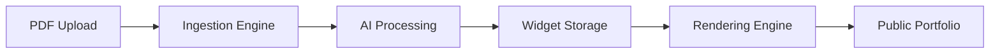

# FolioForge.ai 🚀

> **The Intelligent, Event-Driven Portfolio Platform**
> 
> Transform static PDF resumes into dynamic, deployable personal websites in seconds using AI-powered parsing and a flexible widget system.

[](https://dotnet.microsoft.com/)
[](LICENSE)

---

## 📖 Overview

**FolioForge.ai** is a multi-tenant SaaS platform designed to host personalized portfolios at scale. It leverages **Event-Driven Architecture** and **Clean Architecture** principles to provide a robust, maintainable, and extensible solution for Resume-to-Web conversion.

### The Problem We Solve

- **Static site generators** require manual configuration and technical expertise
- **Traditional resume builders** are rigid and template-locked
- **Portfolio hosting** lacks flexibility and modern design systems

**FolioForge.ai** uses a **Generic Widget System** (inspired by Notion blocks) that decouples data from presentation, enabling infinite customization without database migrations.

---

## 🏗️ Architecture & Design Philosophy

Built on **Clean Architecture** principles with a **CQRS-inspired** flow to separate write (ingestion) from read (rendering) operations.

### Core Components



#### 1. **Ingestion Engine (Write Path)**
- PDF upload handling and validation
- Async AI processing with OpenAI GPT
- Structured data extraction into widgets

#### 2. **Rendering Engine (Read Path)**
- High-performance React SPA
- Generic widget rendering system
- Theme-aware component library

#### 3. **Routing Layer**
- Dynamic subdomain routing (`username.folioforge.ai`)
- Client-side routing with React Router
- Nginx reverse proxy configuration

### Key Engineering Decisions

#### **Generic Widget Protocol**
We don't store "resumes"—we store **Widgets** (Timeline, Grid, Markdown, etc.). This adheres to the **Open/Closed Principle**: adding new widget types (e.g., Spotify Now Playing) requires zero database migrations.

```csharp
// Example: Extensible widget system
public class PortfolioSection : BaseEntity
{
    public string Type { get; set; }        // "timeline", "grid", "markdown"
    public JsonDocument Data { get; set; }  // Flexible JSON storage
}
```

#### **Async Processing**
Heavy AI processing happens in the background using message queues (planned: RabbitMQ/Azure Service Bus). APIs return `202 Accepted` immediately for responsive UX.

#### **Hybrid Storage Strategy**
- **MySQL** for relational data (users, portfolios)
- **JSON columns** for polymorphic widget content
- Combines ACID compliance with NoSQL flexibility

---

## 🛠️ Tech Stack

### Backend

| Component | Technology | Purpose |
|-----------|-----------|---------|
| **Framework** | .NET 9 | Modern web API with minimal APIs |
| **Architecture** | Clean Architecture | Separation of concerns, testability |
| **Database** | SQL Server | Relational data with JSON support |
| **ORM** | Entity Framework Core | Type-safe database access |
| **Validation** | FluentValidation (planned) | Request validation |
| **AI/LLM** | OpenAI API (planned) | Resume parsing & content generation |
| **Messaging** | RabbitMQ (planned) | Async job processing |

### Frontend (Planned)

| Component | Technology | Purpose |
|-----------|-----------|---------|
| **Framework** | React 19 + Vite | Modern SPA development |
| **Styling** | Tailwind CSS | Utility-first CSS framework |
| **Components** | Radix UI | Accessible headless components |
| **State Management** | Zustand + TanStack Query | Client/server state |
| **Animations** | Framer Motion | Smooth transitions |

### DevOps & Infrastructure

- **Containerization:** Docker & Docker Compose
- **Reverse Proxy:** Nginx (local) / Cloudflare (prod)
- **CI/CD:** GitHub Actions (planned)
- **Hosting:** Azure App Service / AWS ECS (planned)

---

## ⚡ Features

### Current
- ✅ Clean Architecture implementation
- ✅ Domain-driven design with entities
- ✅ MySQL database with JSON column support
- ✅ Entity Framework Core with migrations
- ✅ Portfolio and section management

### Planned
- 🔜 **AI-Powered PDF Parsing** - Convert resumes to structured JSON
- 🔜 **Multi-Tenancy** - Subdomain routing (`username.folioforge.ai`)
- 🔜 **Drag-and-Drop Builder** - Reorder sections with ease
- 🔜 **Theming Engine** - Customizable design tokens
- 🔜 **Authentication** - User accounts and authorization
- 🔜 **Public API** - REST endpoints for portfolio CRUD

---

## 🚀 Getting Started

### Prerequisites

- [.NET 9 SDK](https://dotnet.microsoft.com/download)
- [MySQL 8.0+](https://dev.mysql.com/downloads/) or [Docker](https://www.docker.com/)
- IDE: [Visual Studio 2022](https://visualstudio.microsoft.com/) or [VS Code](https://code.visualstudio.com/)

### Quick Start

#### 1. Clone the Repository

```bash
git clone https://github.com/yourusername/FolioForge.ai.git
cd FolioForge.ai
```

#### 2. Database Setup

**Option A: Using Docker**
```bash
docker run --name folioforge-sqlserver \
  -e "ACCEPT_EULA=Y" \
  -e "MSSQL_SA_PASSWORD=YourStrong@Password123" \
  -p 1433:1433 \
  -d mcr.microsoft.com/mssql/server:2022-latest
```

**Option B: Local SQL Server**
```sql
CREATE DATABASE folioforge_db;
```

#### 3. Configure Connection String

Update [appsettings.json](backend/src/FolioForge.Api/appsettings.json):

```json
{
  "ConnectionStrings": {
    "DefaultConnection": "Server=localhost;Database=folioforge_db;User Id=sa;Password=YourStrong@Password123;TrustServerCertificate=True;"
  }
}
```

#### 4. Run Migrations

```bash
cd backend/src/FolioForge.Api
dotnet ef database update
```

#### 5. Run the Application

```bash
dotnet run
```

API will be available at: `https://localhost:7xxx`

---

## 📂 Project Structure

```
FolioForge.ai/
├── backend/
│   ├── FolioForge.sln                    # Solution file
│   └── src/
│       ├── FolioForge.Api/               # 🌐 API Layer
│       │   ├── Program.cs                # Entry point, middleware
│       │   ├── appsettings.json          # Configuration
│       │   └── Properties/
│       │       └── launchSettings.json   # Dev settings
│       │
│       ├── FolioForge.Application/       # 📋 Application Layer
│       │   └── (Use Cases, Services)     # Business logic orchestration
│       │
│       ├── FolioForge.Domain/            # 💎 Domain Layer
│       │   ├── Entities/                 # Core business entities
│       │   │   ├── BaseEntity.cs         # Base entity with audit fields
│       │   │   ├── Portfolio.cs          # Portfolio aggregate root
│       │   │   └── PortfolioSection.cs   # Widget sections
│       │   └── Interfaces/               # Repository contracts
│       │       └── IPortfolioRepository.cs
│       │
│       └── FolioForge.Infrastructure/    # 🔧 Infrastructure Layer
│           ├── Persistence/              # Database context
│           │   └── ApplicationDbContext.cs
│           ├── Repositories/             # Repository implementations
│           │   └── PortfolioRepository.cs
│           └── DependencyInjection.cs    # Service registration
│
├── LICENSE
└── README.md
```

### Architecture Layers

| Layer | Responsibility | Dependencies |
|-------|---------------|--------------|
| **Domain** | Business entities & rules | None (pure) |
| **Application** | Use cases, business logic | Domain |
| **Infrastructure** | External concerns (DB, APIs) | Application, Domain |
| **API** | HTTP endpoints, controllers | All layers |

---

## � Domain Models

### Core Entities

#### **Portfolio**
The aggregate root representing a user's portfolio.

```csharp
public class Portfolio : BaseEntity
{
    public string Slug { get; private set; }              // Unique URL identifier
    public Guid UserId { get; private set; }              // Owner reference
    public string Title { get; private set; }             // Portfolio title
    public bool IsPublished { get; private set; }         // Visibility flag
    public List<PortfolioSection> Sections { get; }       // Widget sections
    public ThemeConfig Theme { get; private set; }        // Design configuration
}
```

#### **PortfolioSection**
Flexible widget container supporting multiple content types.

```csharp
public class PortfolioSection : BaseEntity
{
    public Guid PortfolioId { get; private set; }         // Parent portfolio
    public string SectionType { get; private set; }       // Widget type (timeline, grid, hero, markdown)
    public int SortOrder { get; set; }                    // Display order
    public bool IsVisible { get; set; }                   // Visibility flag
    public string Content { get; private set; }           // JSON content as string
}
```

---

## 🔧 API Endpoints (Planned)

### Portfolios

| Method | Endpoint | Description |
|--------|----------|-------------|
| `GET` | `/api/portfolios` | List user's portfolios |
| `GET` | `/api/portfolios/{slug}` | Get portfolio by slug |
| `POST` | `/api/portfolios` | Create new portfolio |
| `PUT` | `/api/portfolios/{id}` | Update portfolio |
| `DELETE` | `/api/portfolios/{id}` | Delete portfolio |
| `PATCH` | `/api/portfolios/{id}/theme` | Update theme |
| `POST` | `/api/portfolios/{id}/sections` | Add section |

### Public API

| Method | Endpoint | Description |
|--------|----------|-------------|
| `GET` | `/{slug}` | Public portfolio view |

---

## 🧪 Development Roadmap

### ✅ Phase 1: Foundation (Current)
- [x] Clean Architecture setup
- [x] Domain models (Portfolio, PortfolioSection)
- [x] Entity Framework Core integration
- [x] MySQL database with JSON support
- [x] Repository pattern interfaces

### 🚧 Phase 2: Core API (In Progress)
- [ ] User authentication & authorization (JWT)
- [ ] Portfolio CRUD endpoints
- [ ] Section management endpoints
- [ ] Theme customization API
- [ ] Input validation with FluentValidation
- [ ] Unit tests & integration tests

### 📋 Phase 3: AI Integration
- [ ] PDF upload endpoint with validation
- [ ] OpenAI GPT-4 integration
- [ ] Resume parsing to structured widgets
- [ ] Background job processing with RabbitMQ
- [ ] Async processing with 202 Accepted pattern

### 🎨 Phase 4: Frontend Dashboard
- [ ] React + Vite setup
- [ ] User authentication flow
- [ ] Portfolio management dashboard
- [ ] Drag-and-drop widget editor (dnd-kit)
- [ ] Theme selector UI
- [ ] Real-time preview

### 🌐 Phase 5: Public Rendering
- [ ] Public portfolio viewer
- [ ] Generic widget rendering system
- [ ] SEO optimization
- [ ] Social media meta tags
- [ ] Custom 404 pages

### 🚀 Phase 6: Multi-Tenancy & Scaling
- [ ] Subdomain routing (`username.folioforge.ai`)
- [ ] Custom domain support
- [ ] CDN integration for static assets
- [ ] Database sharding strategy
- [ ] Caching layer (Redis)
- [ ] Rate limiting & throttling

---

## 🧪 Testing

```bash
# Run unit tests
dotnet test

# Run with coverage
dotnet test /p:CollectCoverage=true

# Run specific test project
dotnet test backend/tests/FolioForge.Domain.Tests
```

---

## 🐳 Docker Support (Planned)

```yaml
# docker-compose.yml
services:
  api:
    build: ./backend
    ports:
      - "5000:80"
    depends_on:
      - db
    environment:
      - ConnectionStrings__DefaultConnection=Server=db;Database=folioforge_db;User Id=sa;Password=YourStrong@Password123;TrustServerCertificate=True;
  
  db:
    image: mcr.microsoft.com/mssql/server:2022-latest
    environment:
      - ACCEPT_EULA=Y
      - MSSQL_SA_PASSWORD=YourStrong@Password123
    ports:
      - "1433:1433"
```

```bash
# Build and run all services
docker-compose up

# Run in detached mode
docker-compose up -d

# View logs
docker-compose logs -f api
```

---

## 🤝 Contributing

Contributions are welcome! Please follow these guidelines:

1. **Fork** the repository
2. **Create** a feature branch (`git checkout -b feature/amazing-feature`)
3. **Commit** your changes (`git commit -m 'Add amazing feature'`)
4. **Push** to the branch (`git push origin feature/amazing-feature`)
5. **Open** a Pull Request

### Coding Standards
- Follow C# naming conventions (PascalCase for public, camelCase for private)
- Write XML documentation for public APIs
- Write unit tests for new features
- Update documentation as needed
- Keep commits atomic and descriptive
- Follow [Conventional Commits](https://www.conventionalcommits.org/) format

---

## 📈 Performance Considerations

- **Database Indexing:** Unique indexes on `Portfolio.Slug` for O(1) lookups
- **JSON Columns:** Flexible schema without migration overhead
- **Async Processing:** Non-blocking AI operations with message queues
- **Connection Pooling:** Efficient database connection management (enabled by default)
- **Query Optimization:** EF Core tracking disabled for read-only queries
- **Caching Strategy:** Redis for frequently accessed portfolios (planned)

---

## 🔒 Security Best Practices (Planned)

- [ ] JWT-based authentication with refresh tokens
- [ ] Role-based authorization (RBAC) - Admin, User roles
- [ ] Input sanitization & validation (FluentValidation)
- [ ] SQL injection prevention (parameterized queries via EF Core)
- [ ] XSS protection (Content Security Policy headers)
- [ ] CSRF tokens for state-changing operations
- [ ] Rate limiting on public endpoints (ASP.NET Core Rate Limiting)
- [ ] Secure password hashing (ASP.NET Identity with Argon2)
- [ ] HTTPS enforcement in production
- [ ] API key authentication for public API

---

## 📊 Database Schema

```sql
-- Portfolios Table (SQL Server)
CREATE TABLE portfolios (
    Id UNIQUEIDENTIFIER PRIMARY KEY,
    UserId UNIQUEIDENTIFIER NOT NULL,
    Slug NVARCHAR(50) NOT NULL UNIQUE,
    Title NVARCHAR(100) NOT NULL,
    IsPublished BIT NOT NULL DEFAULT 1,
    Theme NVARCHAR(MAX) NOT NULL,              -- JSON stored as string
    CreatedAt DATETIME2 NOT NULL,
    UpdatedAt DATETIME2 NOT NULL
);

CREATE UNIQUE INDEX IX_portfolios_Slug ON portfolios(Slug);

-- Portfolio Sections Table
CREATE TABLE portfolio_sections (
    Id UNIQUEIDENTIFIER PRIMARY KEY,
    PortfolioId UNIQUEIDENTIFIER NOT NULL,
    SectionType NVARCHAR(50) NOT NULL,
    SortOrder INT NOT NULL DEFAULT 0,
    IsVisible BIT NOT NULL DEFAULT 1,
    Content NVARCHAR(MAX) NOT NULL,            -- JSON stored as string
    CreatedAt DATETIME2 NOT NULL,
    UpdatedAt DATETIME2 NOT NULL,
    CONSTRAINT FK_portfolio_sections_portfolios 
        FOREIGN KEY (PortfolioId) REFERENCES portfolios(Id) ON DELETE CASCADE
);

CREATE INDEX IX_portfolio_sections_PortfolioId ON portfolio_sections(PortfolioId);
CREATE INDEX IX_portfolio_sections_SectionType ON portfolio_sections(SectionType);
```

---

## 🤝 Contribution Guidelines

1. **Branching:** Use `feature/`, `bugfix/`, or `hotfix/` prefixes
2. **Commits:** Follow Conventional Commits (e.g., `feat: add spotify widget`, `fix: resolve null reference`)
3. **Code Style:**
   - **C#:** Follows standard .NET conventions (`.editorconfig` included)
   - **React:** ESLint + Prettier enabled (planned)
4. **Pull Requests:** Include description, screenshots (if UI changes), and link to related issues

---

## 📄 License

This project is licensed under the **MIT License** - see the [LICENSE](LICENSE) file for details.

---

## 👨‍💻 Author

**Shivansh**  
📧 [Contact](mailto:your.email@example.com) • 💼 [LinkedIn](#) • 🌐 [Portfolio](#)

---

## 🙏 Acknowledgments

- **Clean Architecture** by Robert C. Martin (Uncle Bob)
- **Domain-Driven Design** concepts by Eric Evans
- **Notion's block-based architecture** for widget system inspiration
- **Microsoft's eShopOnWeb** for Clean Architecture reference implementation
- **Jason Taylor's Clean Architecture Template** for project structure guidance

---

## 📚 Additional Resources

- [Clean Architecture in ASP.NET Core](https://docs.microsoft.com/aspnet/core/fundamentals/)
- [Entity Framework Core Documentation](https://docs.microsoft.com/ef/core/)
- [SQL Server JSON Functions](https://learn.microsoft.com/sql/relational-databases/json/json-data-sql-server)
- [.NET 9 Release Notes](https://learn.microsoft.com/dotnet/core/whats-new/dotnet-9)
- [CQRS Pattern](https://martinfowler.com/bliki/CQRS.html)
- [Repository Pattern](https://docs.microsoft.com/dotnet/architecture/microservices/microservice-ddd-cqrs-patterns/infrastructure-persistence-layer-design)

---

## 🐛 Known Issues

- [ ] Weather forecast endpoint in Program.cs is boilerplate (will be removed)

---

## 📝 Changelog

### [Unreleased]
#### Added
- Clean Architecture project structure
- Domain entities (Portfolio, PortfolioSection, BaseEntity)
- Entity Framework Core with SQL Server provider
- Repository pattern implementation
- Database context with JSON column support (stored as NVARCHAR(MAX))
- RabbitMQ event publisher for async processing
- Background worker service for message consumption
- Portfolio creation API endpoint with file upload support

#### Changed
- Updated to .NET 9
- Using SQL Server instead of MySQL for better JSON handling

#### Fixed
- N/A

---

<div align="center">

**⭐ If you find this project interesting, please give it a star! ⭐**

Made with 💙 and ☕ by developers, for developers

[Report Bug](https://github.com/yourusername/FolioForge.ai/issues) • [Request Feature](https://github.com/yourusername/FolioForge.ai/issues) • [Documentation](#)

</div>
