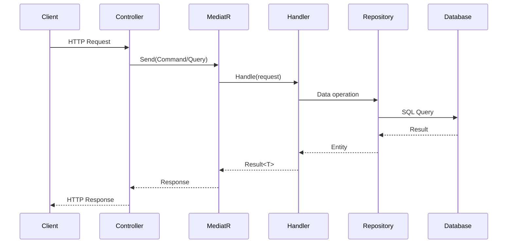

# FolioForge.Api 🌐

> **API Layer - The Entry Point for HTTP Requests**

This is the outermost layer of the Clean Architecture, responsible for handling HTTP requests, configuring dependency injection, and serving as the composition root for the entire application.

---

## 📋 Responsibilities

| Responsibility | Description |
|----------------|-------------|
| **HTTP Handling** | Receive and respond to HTTP requests via ASP.NET Core Controllers |
| **Request Validation** | Validate incoming request DTOs (contracts) |
| **Dependency Injection** | Configure and wire up all services at startup |
| **Middleware Pipeline** | CORS, authentication, authorization, error handling |
| **API Documentation** | Swagger/OpenAPI spec generation |

---

## 📂 Project Structure

```
FolioForge.Api/
├── Controllers/
│   └── PortfoliosController.cs    # Portfolio CRUD + Resume Upload
├── Contracts/
│   └── CreatePortfolioRequest.cs  # Request DTOs
├── Properties/
│   └── launchSettings.json        # Development settings
├── Uploads/                       # Uploaded PDF storage
├── Program.cs                     # Application entry point & DI setup
├── appsettings.json              # Production configuration
└── appsettings.Development.json  # Development configuration
```

---

## 🔧 Key Components

### Program.cs - Composition Root

The `Program.cs` file serves as the composition root where all dependencies are wired together:

```csharp
var builder = WebApplication.CreateBuilder(args);

// Infrastructure Layer Registration
builder.Services.AddInfrastructure(builder.Configuration);

// Application Layer Registration (MediatR)
builder.Services.AddApplication();

// API Layer Configuration
builder.Services.AddControllers();
builder.Services.AddSwaggerGen();
```

#### CORS Configuration

```csharp
builder.Services.AddCors(options =>
{
    options.AddPolicy("AllowReactApp", policy =>
    {
        if (builder.Environment.IsDevelopment())
        {
            // Allow common Vite development ports
            policy.WithOrigins(
                    "http://localhost:5173",
                    "http://localhost:5174",
                    "http://localhost:5175"
                )
                .AllowAnyHeader()
                .AllowAnyMethod()
                .AllowCredentials();
        }
        else
        {
            // Production: Use configuration
            var allowedOrigins = builder.Configuration
                .GetSection("Cors:AllowedOrigins")
                .Get<string[]>();
            
            policy.WithOrigins(allowedOrigins)
                .AllowAnyHeader()
                .AllowAnyMethod();
        }
    });
});
```

---

### PortfoliosController.cs

The main API controller handling all portfolio-related operations:

```csharp
[ApiController]
[Route("api/[controller]")]
public class PortfoliosController : ControllerBase
{
    private readonly ISender _mediator;
    private readonly IEventPublisher _publisher;

    public PortfoliosController(ISender mediator, IEventPublisher publisher)
    {
        _mediator = mediator;
        _publisher = publisher;
    }
}
```

#### Endpoints

| Method | Route | Handler | Description |
|--------|-------|---------|-------------|
| `POST` | `/api/portfolios` | `Create()` | Create new portfolio via MediatR command |
| `GET` | `/api/portfolios/{id:guid}` | `GetById()` | Fetch portfolio with sections via MediatR query |
| `GET` | `/api/portfolios/{slug}` | `GetBySlug()` | Fetch portfolio by URL slug |
| `POST` | `/api/portfolios/{id}/upload-resume` | `UploadResume()` | Upload PDF and publish to RabbitMQ |

---

### Resume Upload Flow

The `UploadResume` endpoint demonstrates the event-driven architecture:

```csharp
[HttpPost("{id}/upload-resume")]
public async Task<IActionResult> UploadResume(Guid id, IFormFile file)
{
    // 1. Validate file
    if (file == null || file.Length == 0)
        return BadRequest("No file uploaded.");
    
    // 2. Save PDF to disk
    var folderPath = Path.Combine(Directory.GetCurrentDirectory(), "Uploads");
    Directory.CreateDirectory(folderPath);
    
    var filePath = Path.Combine(folderPath, $"{id}_{Guid.NewGuid()}.pdf");
    using (var stream = new FileStream(filePath, FileMode.Create))
    {
        await file.CopyToAsync(stream);
    }
    
    // 3. Publish event to RabbitMQ (fire-and-forget)
    await _publisher.PublishAsync(new ResumeUploadedEvent(id, filePath));
    
    // 4. Return 202 Accepted immediately
    return Accepted(new { message = "Resume queued for processing", portfolioId = id });
}
```

**Key Points:**
- Returns `202 Accepted` immediately for responsive UX
- Offloads heavy AI processing to background worker
- Uses event-driven pattern for loose coupling

---

## 🔄 Request/Response Flow



---

## ⚙️ Configuration

### appsettings.json

```json
{
  "ConnectionStrings": {
    "DefaultConnection": "Server=localhost;Database=folioforge_db;User Id=sa;Password=YourStrong@Password123;TrustServerCertificate=True;"
  },
  "Groq": {
    "ApiKey": "your-groq-api-key"
  },
  "Cors": {
    "AllowedOrigins": ["https://yourdomain.com"]
  },
  "Logging": {
    "LogLevel": {
      "Default": "Information",
      "Microsoft.AspNetCore": "Warning"
    }
  }
}
```

---

## 🧪 Running the API

```bash
# Navigate to API project
cd backend/src/FolioForge.Api

# Restore dependencies
dotnet restore

# Run database migrations
dotnet ef database update

# Start the API
dotnet run
```

**Default URLs:**
- HTTPS: https://localhost:7xxx
- HTTP: http://localhost:5xxx
- Swagger UI: http://localhost:5xxx (root)

---

## 📝 Design Decisions

### Why Controllers over Minimal APIs?

| Consideration | Decision |
|--------------|----------|
| **Team familiarity** | Controllers are well-understood by most .NET developers |
| **Swagger integration** | Better out-of-box Swagger support with attributes |
| **Organization** | Natural grouping of related endpoints |
| **Testability** | Easy to mock with dependency injection |

### Why Return 202 for Resume Upload?

Long-running AI operations should not block HTTP requests:
- PDF parsing: ~500ms
- AI processing: ~2-5 seconds
- Database updates: ~100ms

Returning `202 Accepted` allows the client to continue while processing happens asynchronously.

---

## 🔗 Dependencies

| Package | Purpose |
|---------|---------|
| `MediatR` | Command/Query dispatch |
| `Swashbuckle.AspNetCore` | Swagger generation |
| `Microsoft.EntityFrameworkCore.SqlServer` | Database provider |

---

## 📚 Related Documentation

- [FolioForge.Application README](../FolioForge.Application/README.md) - Commands & Queries
- [FolioForge.Domain README](../FolioForge.Domain/README.md) - Domain Entities
- [FolioForge.Infrastructure README](../FolioForge.Infrastructure/README.md) - Data Access & Services
