# FolioForge.Api 🌐

> **API Layer - The Entry Point for HTTP Requests**

This is the outermost layer of the Clean Architecture, responsible for handling HTTP requests, configuring dependency injection, and serving as the composition root for the entire application.

---

## 📋 Responsibilities

| Responsibility | Description |
|----------------|-------------|
| **HTTP Handling** | Receive and respond to HTTP requests via ASP.NET Core Controllers |
| **Authentication** | JWT Bearer token validation and user identity resolution |
| **Tenant Resolution** | Middleware to resolve tenant from JWT or X-Tenant-Id header |
| **Request Validation** | Validate incoming request DTOs (contracts) |
| **Dependency Injection** | Configure and wire up all services at startup |
| **Middleware Pipeline** | CORS, tenant resolution, authentication, authorization |
| **API Documentation** | Swagger/OpenAPI spec with JWT security definitions |

---

## 📂 Project Structure

```
FolioForge.Api/
├── Controllers/
│   ├── AuthController.cs          # Register, Login, Me endpoints
│   ├── PortfoliosController.cs    # Portfolio CRUD + Resume Upload
│   └── TenantsController.cs       # Tenant creation & lookup
├── Contracts/
│   └── CreatePortfolioRequest.cs  # Request DTOs
├── Properties/
│   └── launchSettings.json        # Development settings (5090 HTTP)
├── Uploads/                       # Uploaded PDF storage
├── Program.cs                     # Application entry point & DI setup
├── appsettings.json              # Production configuration (JWT, DB, AI)
└── appsettings.Development.json  # Development configuration
```

---

## 🔧 Key Components

### Program.cs - Composition Root

The `Program.cs` file serves as the composition root where all dependencies are wired together:

```csharp
var builder = WebApplication.CreateBuilder(args);

// Infrastructure Layer (DbContext, Repos, AI services, RabbitMQ, JWT, Tenant)
builder.Services.AddInfrastructure(builder.Configuration);

// Application Layer (MediatR commands/queries)
builder.Services.AddApplication();

// JWT Authentication
builder.Services.AddAuthentication(JwtBearerDefaults.AuthenticationScheme)
    .AddJwtBearer(options => { /* TokenValidationParameters */ });

// API Layer (Controllers + Swagger with JWT security)
builder.Services.AddControllers();
builder.Services.AddSwaggerGen(c => { /* Bearer security definition */ });
```

#### JWT Authentication Configuration

```csharp
var jwtSecret = builder.Configuration["Jwt:Secret"]!;
var jwtIssuer = builder.Configuration["Jwt:Issuer"] ?? "FolioForge";
var jwtAudience = builder.Configuration["Jwt:Audience"] ?? "FolioForge.Client";

builder.Services.AddAuthentication(options =>
{
    options.DefaultAuthenticateScheme = JwtBearerDefaults.AuthenticationScheme;
    options.DefaultChallengeScheme = JwtBearerDefaults.AuthenticationScheme;
})
.AddJwtBearer(options =>
{
    options.TokenValidationParameters = new TokenValidationParameters
    {
        ValidateIssuer = true,
        ValidateAudience = true,
        ValidateLifetime = true,
        ValidateIssuerSigningKey = true,
        ValidIssuer = jwtIssuer,
        ValidAudience = jwtAudience,
        IssuerSigningKey = new SymmetricSecurityKey(Encoding.UTF8.GetBytes(jwtSecret)),
        NameClaimType = JwtRegisteredClaimNames.Sub,
    };
});
```

#### Middleware Pipeline Order

The order of middleware is critical for correct tenant and auth resolution:

```csharp
app.UseCors("AllowReactApp");
app.UseMiddleware<TenantMiddleware>();  // Resolve tenant from JWT or header
app.UseHttpsRedirection();
app.UseAuthentication();               // Validate JWT token
app.UseAuthorization();                // Enforce [Authorize] attribute
app.MapControllers();
```

#### Swagger JWT Configuration

Swagger UI is configured with a Bearer token input for authenticated endpoint testing:

```csharp
builder.Services.AddSwaggerGen(c =>
{
    c.SwaggerDoc("v1", new OpenApiInfo
    {
        Title = "FolioForge API",
        Version = "v1",
        Description = "AI-Powered Portfolio Builder API"
    });

    c.AddSecurityDefinition("Bearer", new OpenApiSecurityScheme
    {
        Name = "Authorization",
        Type = SecuritySchemeType.Http,
        Scheme = "bearer",
        BearerFormat = "JWT",
        In = ParameterLocation.Header,
        Description = "Enter your JWT token"
    });
    c.AddSecurityRequirement(new OpenApiSecurityRequirement { /* ... */ });
});
```

#### CORS Configuration

```csharp
builder.Services.AddCors(options =>
{
    options.AddPolicy("AllowReactApp", policy =>
    {
        if (builder.Environment.IsDevelopment())
        {
            // Allow common Vite development ports
            policy.WithOrigins(
                    "http://localhost:5173",
                    "http://localhost:5174",
                    "http://localhost:5175",
                    "http://127.0.0.1:5173",
                    "http://127.0.0.1:5174"
                )
                .AllowAnyHeader()
                .AllowAnyMethod()
                .AllowCredentials();
        }
        else
        {
            // Production: Explicit origins from configuration
            var allowedOrigins = builder.Configuration
                .GetSection("Cors:AllowedOrigins")
                .Get<string[]>() ?? Array.Empty<string>();
            
            policy.WithOrigins(allowedOrigins)
                .AllowAnyHeader()
                .AllowAnyMethod()
                .AllowCredentials();
        }
    });
});
```

---

### AuthController.cs

Handles user registration and login. These endpoints are **excluded from tenant middleware** — the tenant is resolved from the request body (register) or user record (login).

```csharp
[ApiController]
[Route("api/[controller]")]
public class AuthController : ControllerBase
{
    private readonly IUserRepository _userRepository;
    private readonly ITenantRepository _tenantRepository;
    private readonly IAuthService _authService;
}
```

#### Auth Endpoints

| Method | Route | Auth | Description |
|--------|-------|------|-------------|
| `POST` | `/api/auth/register` | Public | Register a new user under a tenant |
| `POST` | `/api/auth/login` | Public | Login with email & password |
| `GET` | `/api/auth/me` | `[Authorize]` | Get current user profile from JWT |

#### Register Flow

```
1. Validate tenant exists and is active
2. Check email uniqueness globally (cross-tenant)
3. Hash password with BCrypt
4. Create User entity
5. Generate JWT token
6. Return AuthResponse (token, userId, email, tenantId, tenantIdentifier)
```

#### Request/Response DTOs

```csharp
// Register
public record RegisterRequest(
    string Email,
    string FullName,
    string Password,
    string TenantIdentifier
);

// Login
public record LoginRequest(
    string Email,
    string Password
);

// Response (both register & login)
public class AuthResponse
{
    public string Token { get; set; }
    public Guid UserId { get; set; }
    public string Email { get; set; }
    public string FullName { get; set; }
    public Guid TenantId { get; set; }
    public string TenantIdentifier { get; set; }
}
```

---

### TenantsController.cs

Handles tenant management. These endpoints are **excluded from tenant middleware** (no `X-Tenant-Id` header required).

```csharp
[ApiController]
[Route("api/[controller]")]
public class TenantsController : ControllerBase
{
    private readonly ITenantRepository _tenantRepository;
}
```

#### Tenant Endpoints

| Method | Route | Auth | Description |
|--------|-------|------|-------------|
| `POST` | `/api/tenants` | Public | Create a new tenant |
| `GET` | `/api/tenants/{id:guid}` | Public | Get tenant by ID |

#### Create Tenant Flow

```
1. Check if identifier already exists → 409 Conflict
2. Create Tenant entity (Name, Identifier)
3. Return 201 Created with tenant details
```

---

### PortfoliosController.cs

The main API controller handling all portfolio-related operations. **All endpoints require JWT authentication** via the `[Authorize]` attribute.

```csharp
[ApiController]
[Route("api/[controller]")]
[Authorize]
public class PortfoliosController : ControllerBase
{
    private readonly ISender _mediator;
    private readonly IEventPublisher _publisher;

    public PortfoliosController(ISender mediator, IEventPublisher publisher)
    {
        _mediator = mediator;
        _publisher = publisher;
    }
}
```

#### Portfolio Endpoints

| Method | Route | Description |
|--------|-------|-------------|
| `POST` | `/api/portfolios` | Create new portfolio via MediatR command |
| `GET` | `/api/portfolios/{id:guid}` | Fetch portfolio with sections via MediatR query |
| `GET` | `/api/portfolios/{slug}` | Fetch portfolio by URL slug |
| `POST` | `/api/portfolios/{id}/upload-resume` | Upload PDF and publish to RabbitMQ |

#### User ID Extraction

The controller extracts the authenticated user's ID from JWT claims:

```csharp
private Guid GetUserId()
{
    var sub = User.FindFirst(JwtRegisteredClaimNames.Sub)?.Value
           ?? User.FindFirst(ClaimTypes.NameIdentifier)?.Value;
    return Guid.Parse(sub!);
}
```

---

### Resume Upload Flow

The `UploadResume` endpoint demonstrates the event-driven architecture:

```csharp
[HttpPost("{id}/upload-resume")]
public async Task<IActionResult> UploadResume(Guid id, IFormFile file)
{
    // 1. Validate file
    if (file == null || file.Length == 0)
        return BadRequest("No file uploaded.");
    
    // 2. Save PDF to disk
    var folderPath = Path.Combine(Directory.GetCurrentDirectory(), "Uploads");
    Directory.CreateDirectory(folderPath);
    
    var filePath = Path.Combine(folderPath, $"{id}_{Guid.NewGuid()}.pdf");
    using (var stream = new FileStream(filePath, FileMode.Create))
    {
        await file.CopyToAsync(stream);
    }
    
    // 3. Publish event to RabbitMQ (fire-and-forget)
    await _publisher.PublishAsync(new ResumeUploadedEvent(id, filePath));
    
    // 4. Return 202 Accepted immediately
    return Accepted(new { message = "Resume queued for processing", portfolioId = id });
}
```

**Key Points:**
- Returns `202 Accepted` immediately for responsive UX
- Offloads heavy AI processing to background worker
- Uses event-driven pattern for loose coupling

---

## 🔄 Request/Response Flow

```mermaid
sequenceDiagram
    participant Client
    participant TenantMiddleware
    participant Auth
    participant Controller
    participant MediatR
    participant Handler
    participant Repository
    participant Database
    
    Client->>TenantMiddleware: HTTP Request
    TenantMiddleware->>TenantMiddleware: Resolve tenant (JWT → Header)
    TenantMiddleware->>Auth: Pass to auth middleware
    Auth->>Auth: Validate JWT token
    Auth->>Controller: Authenticated request
    Controller->>MediatR: Send(Command/Query)
    MediatR->>Handler: Handle(request)
    Handler->>Repository: Data operation
    Repository->>Database: SQL Query (tenant-filtered)
    Database-->>Repository: Result
    Repository-->>Handler: Entity
    Handler-->>MediatR: Result<T>
    MediatR-->>Controller: Response
    Controller-->>Client: HTTP Response
```



### Tenant Middleware Resolution

The `TenantMiddleware` resolves the current tenant for each request:

```
1. Check if path is excluded (/api/auth/*, /api/tenants/*, /swagger/*)
   → If excluded, skip tenant resolution
2. Try to extract tenantId from JWT claim "tenantId"
   → If found, set tenant context
3. Fall back to X-Tenant-Id header
   → If found, set tenant context
4. If neither found → return 400 Bad Request
```

---

## ⚙️ Configuration

### appsettings.json

```json
{
  "ConnectionStrings": {
    "DefaultConnection": "Data Source=localhost;Initial Catalog=folioforge;Integrated Security=True;TrustServerCertificate=True;Pooling=True"
  },
  "Jwt": {
    "Secret": "FolioForge-SuperSecret-Key-That-Is-At-Least-32-Chars-Long!!",
    "Issuer": "FolioForge",
    "Audience": "FolioForge.Client",
    "ExpirationMinutes": "1440"
  },
  "Groq": {
    "ApiKey": "your-groq-api-key"
  },
  "Cors": {
    "AllowedOrigins": ["https://yourdomain.com"]
  }
}
```

| Setting | Purpose |
|---------|---------|
| `ConnectionStrings:DefaultConnection` | SQL Server connection (Integrated Security for Windows Auth) |
| `Jwt:Secret` | HMAC-SHA256 signing key (min 32 chars) |
| `Jwt:Issuer` | Token issuer claim |
| `Jwt:Audience` | Token audience claim |
| `Jwt:ExpirationMinutes` | Token lifetime (1440 = 24 hours) |
| `Groq:ApiKey` | API key for Groq AI (Llama 3.3-70B) |
| `Cors:AllowedOrigins` | Production allowed origins |

---

## 🧪 Running the API

```bash
# Navigate to API project
cd backend/src/FolioForge.Api

# Restore dependencies
dotnet restore

# Run database migrations
dotnet ef database update

# Start the API
dotnet run
```

**Default URLs:**
- HTTP: http://localhost:5090
- Swagger UI: http://localhost:5090 (root)

---

## 📝 Design Decisions

### Why Controllers over Minimal APIs?

| Consideration | Decision |
|--------------|----------|
| **Team familiarity** | Controllers are well-understood by most .NET developers |
| **Swagger integration** | Better out-of-box Swagger support with attributes |
| **Organization** | Natural grouping of related endpoints |
| **Testability** | Easy to mock with dependency injection |
| **Auth attributes** | Clean `[Authorize]` attribute support per controller or action |

### Why Return 202 for Resume Upload?

Long-running AI operations should not block HTTP requests:
- PDF parsing: ~500ms
- AI processing: ~2-5 seconds
- Database updates: ~100ms

Returning `202 Accepted` allows the client to continue while processing happens asynchronously.

### Why Exclude Auth/Tenant Routes from Tenant Middleware?

| Route | Reason |
|-------|--------|
| `/api/auth/register` | Tenant is provided in the request body (`tenantIdentifier`) |
| `/api/auth/login` | User lookup is cross-tenant (bypasses query filters) |
| `/api/tenants/*` | Tenant management is a global operation |
| `/swagger/*` | API docs are not tenant-scoped |

---

## 🔗 Dependencies

| Package | Purpose |
|---------|---------|
| `MediatR` | CQRS command/query dispatch |
| `Swashbuckle.AspNetCore` | Swagger/OpenAPI generation |
| `Microsoft.AspNetCore.Authentication.JwtBearer` | JWT Bearer token authentication |
| `Microsoft.IdentityModel.Tokens` | Token validation parameters |
| `Microsoft.EntityFrameworkCore.SqlServer` | Database provider |

---

## 📚 Related Documentation

- [FolioForge.Application README](../FolioForge.Application/README.md) - Commands & Queries
- [FolioForge.Domain README](../FolioForge.Domain/README.md) - Domain Entities
- [FolioForge.Infrastructure README](../FolioForge.Infrastructure/README.md) - Data Access & Services
