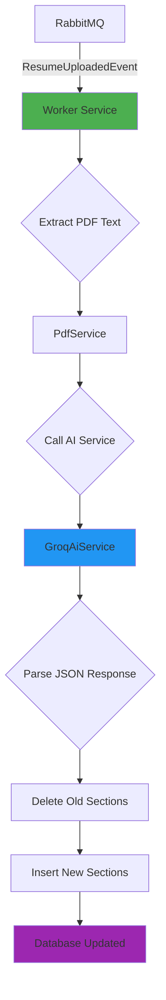

# FolioForge.Worker ⚙️

> **Background Worker Service - Async Resume Processing**

This is a .NET Worker Service that consumes messages from RabbitMQ and processes resume PDFs using AI to generate portfolio sections.

---

## 📋 Responsibilities

| Responsibility | Description |
|----------------|-------------|
| **Message Consumption** | Listen to RabbitMQ queue for resume upload events |
| **PDF Processing** | Extract text from uploaded PDF files |
| **AI Integration** | Send text to AI service for structured extraction |
| **Database Updates** | Persist generated sections to database |
| **Error Handling** | Log errors and prevent message loss |

---

## 📂 Project Structure

```
FolioForge.Worker/
├── Worker.cs                      # Main background service
├── Program.cs                     # Host configuration & DI
├── appsettings.json              # Production configuration
├── appsettings.Development.json  # Development configuration
└── FolioForge.Worker.csproj
```

---

## 🔄 Processing Flow



---

## 🔧 Key Components

### Worker.cs - Background Service

The main worker that processes messages:

```csharp
public class Worker : BackgroundService
{
    private readonly ILogger<Worker> _logger;
    private readonly IServiceScopeFactory _scopeFactory;
    private IConnection _connection;
    private IChannel _channel;
    
    public Worker(ILogger<Worker> logger, IServiceScopeFactory scopeFactory)
    {
        _logger = logger;
        _scopeFactory = scopeFactory;  // For scoped service resolution
    }
    
    public override async Task StartAsync(CancellationToken cancellationToken)
    {
        // Establish RabbitMQ connection
        var factory = new ConnectionFactory { HostName = "localhost" };
        _connection = await factory.CreateConnectionAsync();
        _channel = await _connection.CreateChannelAsync();
        
        // Declare queue (idempotent)
        await _channel.QueueDeclareAsync(
            queue: "resume_processing_queue",
            durable: false,
            exclusive: false,
            autoDelete: false,
            arguments: null
        );
        
        _logger.LogInformation(" [*] Waiting for messages.");
        await base.StartAsync(cancellationToken);
    }
    
    protected override async Task ExecuteAsync(CancellationToken stoppingToken)
    {
        var consumer = new AsyncEventingBasicConsumer(_channel);
        
        consumer.ReceivedAsync += async (model, ea) =>
        {
            var body = ea.Body.ToArray();
            var message = Encoding.UTF8.GetString(body);
            
            _logger.LogInformation($" [x] Received: {message}");
            
            try
            {
                var resumeEvent = JsonSerializer.Deserialize<ResumeUploadedEvent>(message);
                
                if (resumeEvent != null)
                {
                    _logger.LogInformation($"Processing for Portfolio {resumeEvent.PortfolioId}");
                    await ProcessResumeAsync(resumeEvent.FilePath, resumeEvent.PortfolioId);
                }
            }
            catch (Exception ex)
            {
                _logger.LogError($"Error processing message: {ex.Message}");
            }
        };
        
        await _channel.BasicConsumeAsync(
            queue: "resume_processing_queue",
            autoAck: true,
            consumer: consumer
        );
        
        // Keep service alive
        while (!stoppingToken.IsCancellationRequested)
        {
            await Task.Delay(1000, stoppingToken);
        }
    }
}
```

---

### ProcessResumeAsync - Core Logic

The heavy lifting happens here:

```csharp
private async Task ProcessResumeAsync(string filePath, Guid portfolioId)
{
    // Create scope for scoped services (DbContext, etc.)
    using var scope = _scopeFactory.CreateScope();
    
    var dbContext = scope.ServiceProvider.GetRequiredService<ApplicationDbContext>();
    var pdfService = scope.ServiceProvider.GetRequiredService<IPdfService>();
    var aiService = scope.ServiceProvider.GetRequiredService<IAiService>();
    
    try
    {
        // 1. Extract text from PDF
        var text = pdfService.ExtractText(filePath);
        _logger.LogInformation("Text extracted. Calling AI...");
        
        // 2. Call AI for structured extraction
        var jsonString = await aiService.GeneratePortfolioDataAsync(text);
        _logger.LogInformation("AI Data Received!");
        
        // 3. Deserialize response
        var options = new JsonSerializerOptions { PropertyNameCaseInsensitive = true };
        var data = JsonSerializer.Deserialize<AiResultDto>(jsonString, options);
        
        // 4. Delete old sections (Nuke & Pave strategy)
        var existingSections = await dbContext.Sections
            .Where(s => s.PortfolioId == portfolioId)
            .ToListAsync();
        
        if (existingSections.Any())
        {
            dbContext.Sections.RemoveRange(existingSections);
            await dbContext.SaveChangesAsync();
            _logger.LogInformation("Old sections deleted.");
        }
        
        // 5. CRITICAL: Clear EF Core change tracker
        dbContext.ChangeTracker.Clear();
        
        // 6. Insert new sections
        var newSections = new List<PortfolioSection>
        {
            new PortfolioSection("About", 1, 
                JsonSerializer.Serialize(new { content = data.Summary }))
                { PortfolioId = portfolioId },
            
            new PortfolioSection("Skills", 2, 
                JsonSerializer.Serialize(new { items = data.Skills }))
                { PortfolioId = portfolioId },
            
            new PortfolioSection("Timeline", 3, 
                JsonSerializer.Serialize(new { items = data.Experience }))
                { PortfolioId = portfolioId },
            
            new PortfolioSection("Projects", 4, 
                JsonSerializer.Serialize(new { items = data.Projects }))
                { PortfolioId = portfolioId }
        };
        
        await dbContext.Sections.AddRangeAsync(newSections);
        await dbContext.SaveChangesAsync();
        
        _logger.LogInformation("✅ DATABASE UPDATED SUCCESSFULLY!");
    }
    catch (Exception ex)
    {
        _logger.LogError($"Error: {ex.Message}");
    }
}
```

---

## 📦 DTOs for AI Response

```csharp
public class AiResultDto
{
    public string Summary { get; set; }
    public List<string> Skills { get; set; }
    public List<ExperienceDto> Experience { get; set; }
    public List<ProjectDto> Projects { get; set; }
}

public class ExperienceDto
{
    public string Company { get; set; }
    public string Role { get; set; }
    public List<string> Points { get; set; } = new();  // Smart bullet points
}

public class ProjectDto
{
    public string Name { get; set; }
    public string TechStack { get; set; }
    public List<string> Points { get; set; } = new();  // Smart bullet points
}
```

**Why `Points` Array Instead of `Description` String?**
- AI extracts individual achievements as bullet points
- Frontend can render as styled list
- Better for parsing and highlighting
- More structured data model

---

## ⚠️ Critical Design Decisions

### 1. IServiceScopeFactory

```csharp
private readonly IServiceScopeFactory _scopeFactory;

// In ProcessResumeAsync:
using var scope = _scopeFactory.CreateScope();
var dbContext = scope.ServiceProvider.GetRequiredService<ApplicationDbContext>();
```

**Why?**
- Worker is a **Singleton** (runs for entire app lifetime)
- DbContext is **Scoped** (one per request)
- Must create explicit scope for each message
- Prevents memory leaks and stale data

### 2. ChangeTracker.Clear()

```csharp
dbContext.Sections.RemoveRange(existingSections);
await dbContext.SaveChangesAsync();

// CRITICAL: Clear the tracker
dbContext.ChangeTracker.Clear();

await dbContext.Sections.AddRangeAsync(newSections);
```

**Why?**
- EF Core tracks deleted entities in memory
- Without clearing, it tries to re-insert deleted rows
- Causes primary key conflicts
- "Nuke & Pave" pattern requires clean slate

### 3. Direct Foreign Key Insert

```csharp
new PortfolioSection("About", 1, content)
{ 
    PortfolioId = portfolioId  // Set FK directly
}
```

**Why?**
- Don't need to load parent Portfolio entity
- Faster database operation
- Reduces memory usage
- FK constraint ensures data integrity

---

## 🚀 Running the Worker

```bash
# Navigate to worker project
cd backend/src/FolioForge.Worker

# Run the worker
dotnet run
```

**Expected Output:**
```
info: FolioForge.Worker.Worker[0]
      [*] Waiting for messages.
info: FolioForge.Worker.Worker[0]
      [x] Received: {"PortfolioId":"...","FilePath":"..."}
info: FolioForge.Worker.Worker[0]
      Text extracted. Calling AI...
info: FolioForge.Worker.Worker[0]
      AI Data Received!
info: FolioForge.Worker.Worker[0]
      Old sections deleted.
info: FolioForge.Worker.Worker[0]
      ✅ DATABASE UPDATED SUCCESSFULLY!
```

---

## ⚙️ Configuration

### appsettings.json

```json
{
  "ConnectionStrings": {
    "DefaultConnection": "Server=localhost;Database=folioforge_db;..."
  },
  "Groq": {
    "ApiKey": "your-groq-api-key"
  },
  "Logging": {
    "LogLevel": {
      "Default": "Information",
      "Microsoft.Hosting.Lifetime": "Information"
    }
  }
}
```

---

## 🔗 Dependencies

```xml
<ItemGroup>
    <ProjectReference Include="..\FolioForge.Infrastructure\FolioForge.Infrastructure.csproj" />
    
    <PackageReference Include="Microsoft.Extensions.Hosting" Version="9.x" />
    <PackageReference Include="RabbitMQ.Client" Version="7.x" />
</ItemGroup>
```

---

## 🧪 Testing Locally

1. **Start RabbitMQ:**
   ```bash
   docker run -d -p 5672:5672 -p 15672:15672 rabbitmq:3-management
   ```

2. **Start Worker:**
   ```bash
   dotnet run --project backend/src/FolioForge.Worker
   ```

3. **Upload a Resume:**
   ```bash
   curl -X POST http://localhost:5000/api/portfolios/{id}/upload-resume \
     -F "file=@resume.pdf"
   ```

4. **Check Worker Logs** - You should see processing messages

5. **Verify Database:**
   ```sql
   SELECT * FROM Sections WHERE PortfolioId = 'your-portfolio-id';
   ```

---

## 📚 Related Documentation

- [FolioForge.Api README](../FolioForge.Api/README.md) - Resume upload endpoint
- [FolioForge.Infrastructure README](../FolioForge.Infrastructure/README.md) - AI & PDF services
