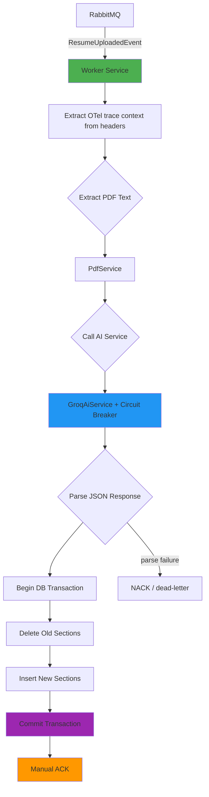

# FolioForge.Worker ⚙️

> **Background Worker Service - Async Resume Processing**

This is a .NET Worker Service that consumes messages from RabbitMQ and processes resume PDFs using AI to generate portfolio sections.

---

## 📋 Responsibilities

| Responsibility | Description |
|----------------|-------------|
| **Message Consumption** | Listen to RabbitMQ queue for resume upload events |
| **PDF Processing** | Extract text from uploaded PDF files |
| **AI Integration** | Send text to AI service for structured extraction |
| **Database Updates** | Persist generated sections to database |
| **Error Handling** | Log errors and prevent message loss |

---

## 📂 Project Structure

```
FolioForge.Worker/
├── Worker.cs                      # Main background service
├── Program.cs                     # Host configuration & DI
├── appsettings.json              # Production configuration
├── appsettings.Development.json  # Development configuration
└── FolioForge.Worker.csproj
```

---

## 🔄 Processing Flow


```mermaid
graph TD
    A[RabbitMQ] -->|ResumeUploadedEvent| B[Worker Service]
    B --> B1[Extract OTel trace context from headers]
    B1 --> C{Extract PDF Text}
    C --> D[PdfService]
    D --> E{Call AI Service}
    E --> F[GroqAiService + Circuit Breaker]
    F --> G{Parse JSON Response}
    G --> H[Begin DB Transaction]
    H --> I[Delete Old Sections]
    I --> J[Insert New Sections]
    J --> K[Commit Transaction]
    K --> L[Manual ACK]
    G -->|parse failure| M[NACK / dead-letter]
    
    style B fill:#4CAF50
    style F fill:#2196F3
    style K fill:#9C27B0
    style L fill:#FF9800
```

---

## 🔧 Key Components

### Worker.cs - Background Service

Key design choices versus the initial prototype:

| Feature | Implementation |
|---------|---------------|
| **RabbitMQ host** | Read from `configuration["RabbitMq:HostName"]`; defaults to `"localhost"` |
| **Queue durability** | `durable: true` — messages survive broker restarts |
| **Prefetch** | `BasicQosAsync(prefetchCount: 1)` — one unacked message at a time (fair dispatch) |
| **Acknowledgement** | Manual `BasicAckAsync` after success; `BasicNackAsync(requeue: false)` on failure (dead-letter) |
| **OTel tracing** | Consumer span started from W3C context extracted from message headers; linked to original producer trace |
| **Metrics** | `FolioForgeDiagnostics.ResumeProcessingDuration` histogram + `MessagesProcessed` counter |

```csharp
public Worker(ILogger<Worker> logger, IServiceScopeFactory scopeFactory, IConfiguration configuration)
{
    _logger = logger;
    _scopeFactory = scopeFactory;
    _rabbitHost = configuration["RabbitMq:HostName"] ?? "localhost";
}

public override async Task StartAsync(CancellationToken cancellationToken)
{
    var factory = new ConnectionFactory { HostName = _rabbitHost };
    _connection = await factory.CreateConnectionAsync();
    _channel = await _connection.CreateChannelAsync();

    await _channel.QueueDeclareAsync(
        queue: "resume_processing_queue",
        durable: true,       // Survive broker restart
        exclusive: false,
        autoDelete: false,
        arguments: null);

    await _channel.BasicQosAsync(
        prefetchSize: 0,
        prefetchCount: 1,    // Don't overwhelm the worker
        global: false);

    _logger.LogInformation(" [*] Waiting for messages. ");
    await base.StartAsync(cancellationToken);
}
```

In `ExecuteAsync`, the consumer sets `autoAck: false`. After processing:
- **Success** → `BasicAckAsync(deliveryTag, multiple: false)`
- **Failure** → `BasicNackAsync(deliveryTag, multiple: false, requeue: false)` (poison messages go to dead-letter, not infinite retry)

---

### ProcessResumeAsync - Core Logic

Presents a **Transactional Nuke & Pave** strategy: old sections are deleted and new AI-generated ones are inserted inside a single database transaction, ensuring atomicity (insert failure rolls back the delete).

```csharp
private async Task ProcessResumeAsync(string filePath, Guid portfolioId)
{
    using var scope = _scopeFactory.CreateScope();
    var dbContext = scope.ServiceProvider.GetRequiredService<ApplicationDbContext>();
    var pdfService = scope.ServiceProvider.GetRequiredService<IPdfService>();
    var aiService  = scope.ServiceProvider.GetRequiredService<IAiService>();

    // 1. Extract text
    var text = pdfService.ExtractText(filePath);

    // 2. Call AI (wrapped in circuit breaker via ResilientAiServiceDecorator)
    var jsonString = await aiService.GeneratePortfolioDataAsync(text);
    var data = JsonSerializer.Deserialize<AiResultDto>(jsonString, ...);
    if (data is null) throw new InvalidOperationException("Failed to deserialize AI response.");

    // 3. Transactional Nuke & Pave
    await using var transaction = await dbContext.Database.BeginTransactionAsync();
    try
    {
        var existing = await dbContext.Sections
            .Where(s => s.PortfolioId == portfolioId).ToListAsync();
        dbContext.Sections.RemoveRange(existing);
        await dbContext.SaveChangesAsync();

        dbContext.ChangeTracker.Clear(); // Prevent EF conflicts

        var newSections = new List<PortfolioSection>
        {
            new("About",    1, JsonSerializer.Serialize(new { content = data.Summary    })) { PortfolioId = portfolioId },
            new("Skills",   2, JsonSerializer.Serialize(new { items   = data.Skills     })) { PortfolioId = portfolioId },
            new("Timeline", 3, JsonSerializer.Serialize(new { items   = data.Experience })) { PortfolioId = portfolioId },
            new("Projects", 4, JsonSerializer.Serialize(new { items   = data.Projects   })) { PortfolioId = portfolioId },
        };
        await dbContext.Sections.AddRangeAsync(newSections);
        await dbContext.SaveChangesAsync();
        await transaction.CommitAsync();
    }
    catch
    {
        await transaction.RollbackAsync();
        throw;
    }
}
```
### Program.cs

```csharp
IHost host = Host.CreateDefaultBuilder(args)
    .ConfigureServices((hostContext, services) =>
    {
        // 1. Infrastructure (DB, Redis, AI services, RabbitMQ publisher)
        services.AddInfrastructure(hostContext.Configuration);

        // 2. OpenTelemetry: tracing (Jaeger) + metrics (Prometheus)
        services.AddFolioForgeOpenTelemetry(hostContext.Configuration);

        // 3. Worker
        services.AddHostedService<Worker>();
    })
    .Build();

host.Run();
```

---

## 📦 DTOs for AI Response

```csharp
public class AiResultDto
{
    public string Summary { get; set; } = string.Empty;
    public List<string> Skills { get; set; } = new();
    public List<ExperienceDto> Experience { get; set; } = new();
    public List<ProjectDto> Projects { get; set; } = new();
}

public class ExperienceDto
{
    public string Company { get; set; } = string.Empty;
    public string Role { get; set; } = string.Empty;
    public List<string> Points { get; set; } = new();  // Structured bullet points
}

public class ProjectDto
{
    public string Name { get; set; } = string.Empty;
    public string TechStack { get; set; } = string.Empty;
    public List<string> Points { get; set; } = new();
}
```

---

## 🚀 Running the Worker

```bash
# Navigate to worker project
cd backend/src/FolioForge.Worker

# Run the worker
dotnet run
```

**Expected console output:** Structured log messages for connection, message receipt, AI call, transaction commit, and ACK.

---

## ⚙️ Configuration

### appsettings.json

```json
{
  "ConnectionStrings": {
    "DefaultConnection": "Server=localhost;Database=folioforge_db;..."
  },
  "Groq": {
    "ApiKey": "your-groq-api-key"
  },
  "Logging": {
    "LogLevel": {
      "Default": "Information",
      "Microsoft.Hosting.Lifetime": "Information"
        ,
        "ConnectionStrings": {
            "Redis": "localhost:6379"
        },
        "RabbitMq": {
            "HostName": "localhost"
        },
        "OpenTelemetry": {
            "ServiceName": "FolioForge.Worker",
            "OtlpEndpoint": "http://localhost:4317",
            "Sampling": { "SuccessRatio": 1.0 }
        {
            "ConnectionStrings": {
                "DefaultConnection": "Server=localhost;Database=folioforge_db;...",
                "Redis": "localhost:6379"
            },
            "RabbitMq": {
                "HostName": "localhost"
            },
            "Groq": {
                "ApiKey": "your-groq-api-key"
            },
            "OpenTelemetry": {
                "ServiceName": "FolioForge.Worker",
                "OtlpEndpoint": "http://localhost:4317",
                "Sampling": { "SuccessRatio": 1.0 }
            },
            "Logging": {
                "LogLevel": {
                    "Default": "Information",
                    "Microsoft.Hosting.Lifetime": "Information"
                }
            }
        }
        }
    }
  }
}
```

---

## 🔗 Dependencies

```xml
<ItemGroup>
    <ProjectReference Include="..\FolioForge.Infrastructure\FolioForge.Infrastructure.csproj" />
    
    <PackageReference Include="Microsoft.Extensions.Hosting" Version="9.x" />
    <PackageReference Include="RabbitMQ.Client" Version="7.x" />
</ItemGroup>
```

---

## 🧪 Testing Locally

1. **Start RabbitMQ:**
   ```bash
   docker run -d -p 5672:5672 -p 15672:15672 rabbitmq:3-management
   ```

2. **Start Worker:**
   ```bash
   dotnet run --project backend/src/FolioForge.Worker
   ```

3. **Upload a Resume (requires JWT):**
   ```bash
   curl -X POST http://localhost:5090/api/portfolios/{id}/upload-resume \
     -H "Authorization: Bearer {your-jwt-token}" \
     -F "file=@resume.pdf"
   ```

4. **Check Worker Logs** - You should see processing messages

5. **Verify Database:**
   ```sql
   SELECT * FROM Sections WHERE PortfolioId = 'your-portfolio-id';
   ```

---

## 📚 Related Documentation

- [FolioForge.Api README](../FolioForge.Api/README.md) - Resume upload endpoint
- [FolioForge.Infrastructure README](../FolioForge.Infrastructure/README.md) - AI & PDF services
